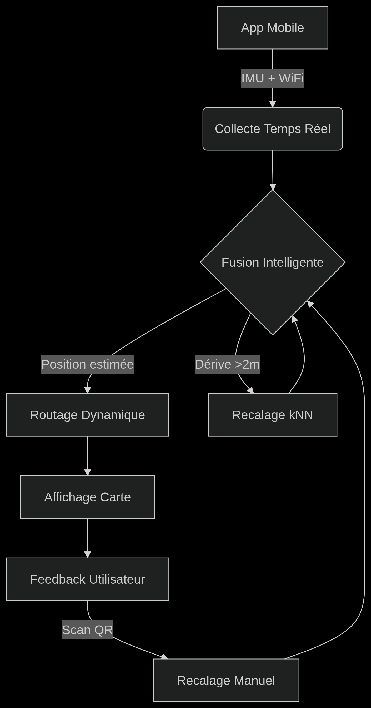

# Indoor Routing & Localization System

This project was developed during my engineering internship at the **Universitat Oberta de Catalunya**, under the supervision of **Dr. Pérez-Navarro**.  
It aims to provide a lightweight, mobile-friendly **indoor navigation system** based on **QR codes**, **IMU sensors (PDR)**, and **Wi‑Fi fingerprinting**.



## Project Goals

- Generate QR codes for each room (201 to 225) to be placed at the door.
- Upon scanning a QR code:
  - Open a web page showing the **current location**.
  - Display a list of **available destinations**.
  - (Coming soon) Show the **path to the destination**.
- Continuously collect **mobile sensor data** (Wi‑Fi, magnetometer, accelerometer).
- Compute indoor location by combining:
  - **PDR** (Pedestrian Dead Reckoning).
  - **Wi‑Fi fingerprinting** (kNN with stats).
  - **Fusion filtering** (e.g., Kalman Filter).

---

## Project Structure

```text
project/
├── algorithms/             # Core positioning logic
│   ├── filters.py          # Fusion filters (e.g. Kalman)
│   ├── fingerprint.py      # Wi-Fi kNN positioning
│   ├── fusion.py           # Combines QR, PDR, Wi-Fi
│   ├── PDR.py              # PDR trajectory from IMU
│   └── pathfinding.py      # Pathfinding logic
│
├── archives/               # Archived and legacy code
│   ├── legacy_tools/       # Older tools and scripts
│   └── simulation/         # Simulation scripts
│
├── data/                  # Data files and resources
│   ├── graph/             # Graph data and visualizations
│   ├── pdr_traces/        # PDR trace files
│   ├── processed/         # Processed data files
│   ├── qr_events.json     # QR events data
│   ├── recordings/        # Sensor data recordings
│   └── simulation_result.png
│
├── scripts/               # Various utility scripts
│   ├── digitize_plan.py   # Plan digitization
│   └── ...                # Other utility scripts
│
├── services/             # Service scripts
│   ├── geolocate.py      # Geolocation utilities
│   ├── utils.py          # Utility functions
│   └── ...               # Other service scripts
│
├── tests/                # Test suite
│   ├── test_filter.py    # Test for filters logic
│   └── ...               # Other test files
│
├── web/                 # Web application components
│   ├── app.py           # Flask backend and routing
│   ├── static/          # JS, CSS, and other static files
│   └── templates/       # HTML templates (Jinja2)
│
├── config.py            # Environment and path setup
├── main.py              # Entry point, e.g., test script
├── Dockerfile           # For containerized deployment
├── pyproject.toml       # Project configuration with UV (Astral)
├── README.md            # Project documentation
├── roadmap.txt          # Development checklist
└── uv.lock              # Dependency lock file for UV

```

## Prerequisites

Ensure you have Python installed on your system. The project uses uv for dependency management, which is part of the Astral project. You can install uv using the following command:
```text
pip install uv
```
## Installation

To set up the project locally, follow these steps:

Clone the repository:
```text
git clone https://github.com/project/indoor-routing.git
cd indoor-routing
```
Install dependencies using UV:
```text
uv sync
```
Set up environment variables by copying .env.example to .env and adjusting as needed.

## Usage

### Running the Server
To start the Flask server, execute the following command from the root directory of the project:
python web/app.py
This will start the server, and the application will be accessible at http://localhost:5000.

### Generating QR Codes
You can generate QR codes for rooms using the script located in the scripts/qr_generator directory. Run:
python scripts/qr_generator/generate_qr.py
This script will create QR codes for each room and save them in the web/qrcodes directory.

### Testing

To run tests, use the following command:
```text
pytest tests/
```
This will execute the test suite and provide output regarding test results.

## Contributing

Contributions to the project are welcome! Please ensure that you follow these guidelines when submitting contributions:

Fork the repository and create your feature branch from main.
Write clear, concise commit messages.
Ensure your changes do not break existing functionality.
Submit a pull request detailing what your changes do and why they are necessary.

## Contact

For questions or feedback, please reach out to [albernye@gmail.com].

## Future development goals include:

Adding path visualization to destinations.
Enhancing the Wi-Fi fingerprinting algorithm for improved accuracy.
Implementing real-time updates and notifications.


This README outlines the project's purpose, structure, setup, usage, and contribution guidelines. Adjust the content as necessary